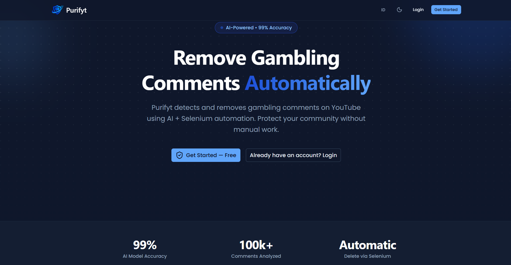
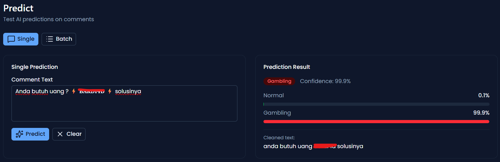

# Purifyt

Purifyt is a YouTube comment moderation and dataset platform for collecting comments, cleaning text, managing datasets, classifying online gambling comments, and assisting YouTube Studio cleanup workflows. It includes a FastAPI backend, a Nuxt web interface, and a Tauri desktop shell.



## Table of Contents

- [Overview](#overview)
- [Prediction Workflow](#prediction-workflow)
- [Features](#features)
- [Tech Stack](#tech-stack)
- [Quick Start](#quick-start)
- [Documentation](#documentation)
- [Project Structure](#project-structure)
- [Development](#development)

## Overview

Purifyt helps build and maintain YouTube comment datasets for online gambling comment detection. The application can import comments from YouTube, import datasets from Kaggle, normalize comment text, run BERT-based predictions, manually correct labels, and expose the result through API, web UI, and desktop app workflows.

The backend stores data in MySQL during local development using async SQLAlchemy. Compiled standalone builds switch to SQLite. Authentication uses short-lived JWT access tokens and rotated HttpOnly refresh-token cookies. Long-running explorer and auto-delete flows stream progress through server-sent events.

## Prediction Workflow
The prediction workflow takes raw comments, cleans the text, runs inference through a BERT model, and stores the predicted label alongside the original comment.




## Features

- YouTube Data API integration for searching videos and importing comments.
- YouTube scan flow for prediction without saving results.
- Kaggle CSV import for external dataset ingestion.
- Dataset management with comment listing, search, manual dataset creation, and deletion workflows.
- BERT-based binary classification for detecting judi online comments.
- Manual label correction for single comments and bulk dataset corrections.
- Text cleaning pipeline for emojis, repeated punctuation, zero-width characters, URLs, and noisy text.
- Video explorer and channel explorer with server-sent event progress updates.
- Auto-delete assistant for YouTube Studio cookie login, comment scanning, preview, deletion, and cookie-account management.
- JWT authentication with access tokens and rotated HttpOnly refresh-token cookies.
- Settings API for YouTube and Kaggle credentials stored in the database.
- Nuxt web application with internationalization support.
- Tauri desktop app support for packaging the frontend as a desktop application.

## Tech Stack

| Layer | Technology |
|-------|------------|
| Backend | FastAPI, SQLAlchemy Async, Pydantic, Server-Sent Events |
| Database | MySQL for development, SQLite for compiled standalone builds |
| ML | Transformers / BERT model assets |
| Frontend | Nuxt 4, Vue, Pinia, Nuxt UI, Tailwind CSS |
| Desktop | Tauri 2 |
| Testing | Pytest |

## Quick Start

### Backend

```bash
git clone https://github.com/RanggaCasper/Purifyt.git
cd Purifyt
pip install -r requirements.txt
cp .env.example .env
```

Create the database:

```sql
CREATE DATABASE purifyt CHARACTER SET utf8mb4 COLLATE utf8mb4_unicode_ci;
```

Run the API:

```bash
uvicorn app.main:app --reload
```

Open `http://localhost:51441/docs` for the Swagger UI.

### Website

```bash
cd website
pnpm install
pnpm dev
```

### Desktop App

```bash
cd website
pnpm desktop
```

Build the desktop app:

```bash
cd website
pnpm build:desktop
```

## Documentation

Longer documentation is split into `docs/`:

| Document | Description |
|----------|-------------|
| [Setup Guide](docs/setup.md) | Environment variables, backend, frontend, desktop, and test setup. |
| [API Reference](docs/api.md) | Main API endpoint groups and request/response examples. |
| [Architecture](docs/architecture.md) | Backend, frontend, desktop, database, and service structure. |
| [Dataset Guide](docs/dataset.md) | Dataset schema, source tracking, and comment processing flow. |

## Project Structure

```text
Purifyt/
├── app/                  # FastAPI backend
│   ├── api/              # API router and versioned endpoints
│   ├── core/             # Runtime config and logging
│   ├── db/               # Async DB connection and ORM models
│   ├── modules/          # Feature modules and services
│   └── shared/           # Shared utilities and data
├── docs/                 # Project documentation and screenshots
├── model/                # BERT model assets
├── tests/                # Backend tests
├── website/              # Nuxt frontend and Tauri desktop shell
├── .env.example          # Environment variable template
├── purifyt.spec          # PyInstaller spec
├── requirements.txt      # Python dependencies
└── README.md
```

See [Architecture](docs/architecture.md) for the detailed module breakdown.

## Development

Useful commands:

| Command | Description |
|---------|-------------|
| `uvicorn app.main:app --reload --port 51441` | Run the backend API locally on the frontend default API port. |
| `pytest` | Run backend tests. |
| `cd website && pnpm dev` | Run the Nuxt web app. |
| `cd website && pnpm build` | Build the Nuxt web app. |
| `cd website && pnpm lint` | Run frontend linting. |
| `cd website && pnpm typecheck` | Run Nuxt/Vue type checking. |
| `cd website && pnpm desktop` | Run the Tauri desktop app in development. |
| `cd website && pnpm build:desktop` | Build the desktop app. |
